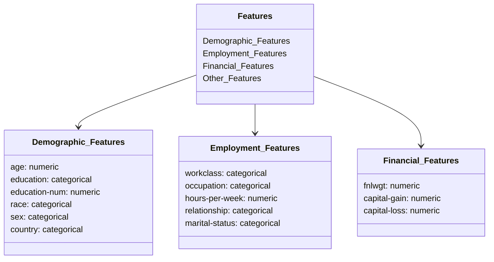

# MWC-Module-3-Modular-Workflow-and-Project-Setup-Basics

Extended Problem Statement:

Business Context:

The project aims to develop a machine learning system that predicts individual income levels based on demographic and employment data
The prediction boundary is set at $50,000 annually (binary classification problem)
The solution will help in understanding socio-economic factors affecting income levels

Dataset Details:
Let's visualize the data structure and features:

